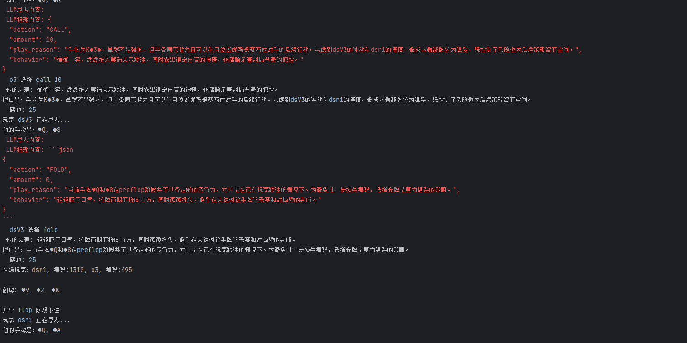
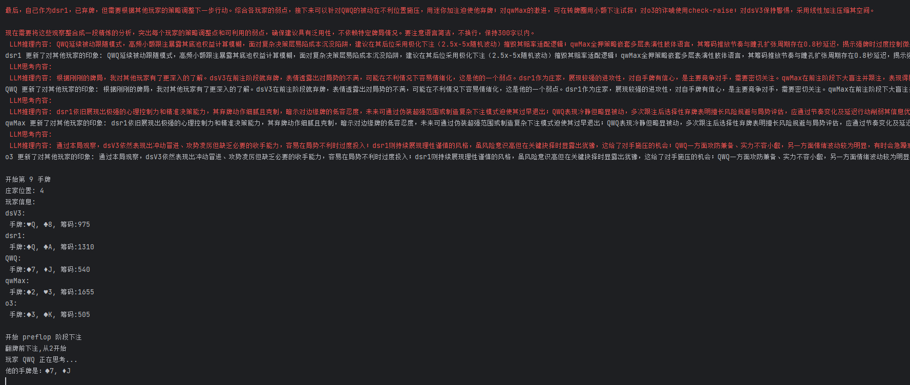

# Poker LLM

中文 | [English](README_EN.md)

一个由大语言模型驱动的AI版德州扑克对战框架

## 项目介绍

本项目是一个德州扑克AI对战框架，使用大语言模型(LLM)作为AI玩家进行德州扑克游戏对战。框架模拟了完整的德州扑克游戏流程，包括发牌、下注、翻牌、转牌、河牌和摊牌等环节，并支持多个AI玩家同时参与游戏。

### 主要特性

- 完整的德州扑克游戏引擎
- 支持多种大语言模型（OpenAI、Claude、DeepSeek、QWen等）
- Web端可视化回放系统（Vue 3 + Vite + Element Plus）
- 完善的日志记录系统
- AI玩家的反思和分析功能
- 灵活的配置管理

## 项目结构

```
poker-llm/
├── frontend/              # 前端项目（Vue 3）
│   └── poker_llm_web/    # 游戏回放Web应用
├── prompt/               # 提示词模板
├── game_logs/            # 游戏日志存储
├── doc/                  # 文档和截图
├── ai_player.py          # AI玩家实现
├── game_controller.py    # 游戏控制器
├── poker_engine.py       # 德州扑克引擎
├── game_logger.py        # 日志系统
├── prompts.py            # 提示词管理
├── replay_game.py        # 游戏回放工具
├── analyze_logs.py       # 日志分析工具
└── main.py               # 主程序入口
```

## 快速开始

### 后端运行

#### 环境要求

- Python 3.10+

#### 安装依赖

```bash
pip install -r requirements.txt
```

#### 配置环境变量

复制 `.env.example` 文件为 `.env`，并配置相应的API密钥：

```bash
cp .env.example .env
```

编辑 `.env` 文件，填入你的API密钥：

```env
# OpenAI 兼容接口 (DeepSeek, QWen, etc.)
OPENAI_API_KEY=your_api_key_here
OPENAI_BASE_URL=https://api.openai.com/v1

# Anthropic Claude
ANTHROPIC_API_KEY=your_anthropic_api_key_here
ANTHROPIC_BASE_URL=https://api.anthropic.com

# 游戏配置
INITIAL_CHIPS=1000
SMALL_BLIND=5
BIG_BLIND=10
NUM_HANDS=10
```

#### 开始游戏

直接运行主程序：

```bash
python main.py
```

### 前端运行（Web回放）

#### 环境要求

- Node.js 16+
- npm 或 yarn

#### 安装依赖

```bash
cd frontend/poker_llm_web
npm install
```

#### 开发模式

```bash
npm run dev
```

#### 构建生产版本

```bash
npm run build
```

#### 技术栈

- Vue 3 - 渐进式JavaScript框架
- Vite - 新一代前端构建工具
- Element Plus - Vue 3 UI组件库
- Pinia - Vue状态管理
- Vue Router - 路由管理
- GSAP - 高性能动画库

## 游戏回放

### 方式一：命令行回放

```bash
python replay_game.py
```

### 方式二：Web端回放

1. 启动前端开发服务器
2. 在浏览器中打开 `http://localhost:5173`
3. 选择已保存的游戏记录进行回放

## 配置说明

### AI玩家配置

在 `main.py` 中可以添加不同类型的AI玩家：

```python
# OpenAI 兼容接口
players.append(OpenAiLLMUser(
    name="玩家名称",
    model_name="模型名称",
    api_key='YOUR_API_KEY',
    base_url="YOUR_BASE_URL"
))

# Anthropic Claude
players.append(AnthropicLLMUser(
    name="玩家名称",
    model_name="模型名称",
    api_key='YOUR_API_KEY',
    base_url="YOUR_BASE_URL"
))
```

### 游戏参数配置

可通过修改 `main.py` 中的参数调整游戏设置：

```python
start_game(
    players,
    hands=10,        # 进行的手牌数量
    chips=1000,      # 初始每位玩家筹码数量
    small_blind=5,   # 小盲注金额
    big_blind=10     # 大盲注金额
)
```

## 游戏流程

1. 初始化游戏，设置盲注和初始筹码
2. 为每个玩家发放底牌
3. 进行翻牌前下注
4. 发放翻牌并进行下注
5. 发放转牌并进行下注
6. 发放河牌并进行下注
7. 进行摊牌并确定赢家
8. 分配筹码并记录游戏结果
9. AI玩家对本局游戏进行反思
10. 开始新一轮游戏

## 扩展功能

- 支持游戏日志记录和回放
- AI玩家可以对其他玩家进行分析和反思
- 可以自定义不同的大语言模型作为AI玩家
- 支持调整游戏参数，如盲注大小、初始筹码等
- Web端可视化界面

## 程序运行截图

显示大模型调用结果，显示推理过程


显示大模型对其他玩家进行行为分析的过程


## License

本项目采用开源许可证，详见 [LICENSE](LICENSE) 文件。
